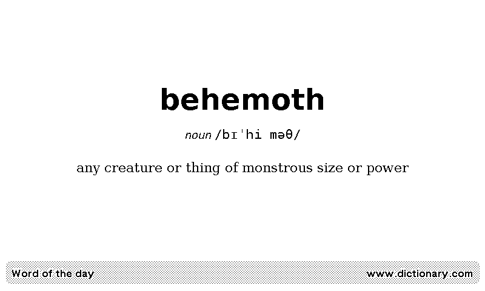

# TRMNL Word of the Day private plugin

Word of the Day private plugin for TRMNL.



## Details
This private plugin for TRMNL retrieves the Word of the Day from various online dictionaries 
and presents it in a clear, organized format. It extracts key details such as the word, 
its definition, pronunciation, and an example of usage (when available). 
By aggregating data from multiple sources, the plugin offers users a convenient 
and enriching way to expand their vocabulary. Ideal for language learners and word enthusiasts, 
it provides seamless access to daily linguistic insights from trusted dictionary platforms.

## Requirements
This code interacts with various web sites and the TRMNL webhook API. You will need to host and execute 
the code yourself to periodically push updated words to TRMNL.

## Setup
1. In TRMNL, navigate to **Plugins -> Private Plugin -> Add New**. Assign a name and select "Webhook" as the strategy. Save the settings.
2. Copy the contents of ``template.html.liquid`` and paste it into the markup section of your TRMNL plugin.
3. Copy the Plugin UUID and your TRMNL API key.
4. Download the code and rename the ``.env_template`` file to ``.env``. Then, populate it as follows:
```
TRMNL_API_KEY=<your api key>
TRMNL_PLUGIN_ID=<your plugin UUID>
```

5. Run ``bundle``

6. Run ``main.rb``. If it successfully posts data to TRMNL, you are all set. You can refresh the TRMNL interface to check if the data is visible.

To ensure the data remains current, schedule the script to run at regular intervals that suit your requirements, such as using cron jobs.

### Links

- https://help.usetrmnl.com/en/articles/9510536-private-plugins
- https://usetrmnl.com/framework
- https://github.com/Shopify/liquid
- https://github.com/usetrmnl/plugins
- https://docs.usetrmnl.com/go/private-plugins/create-a-screen